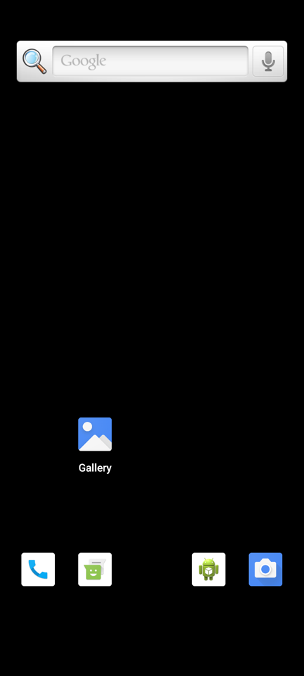

# Android 12 on Apex — status and bring-up log

Target baseline: **Android 12L (API 32), ARM64**, kernel **android12-5.10 GKI**.

## What is delivered and verified

| Part | Artifact | Verification |
|---|---|---|
| Kernel | `out/Image.gz` — android12-5.10 (5.10.269) + `guest/kernel/android12-5.10.fragment` | Built with clang/LLVM; `ARM64_4K_PAGES, VIRTIO_MMIO, VIRTIO_BLK, VIRTIO_CONSOLE, DRM_VIRTIO_GPU, VIRTIO_INPUT, ANDROID_BINDER_IPC, ASHMEM` all `=y`, **0 modules** (`scripts/build-kernel.sh` fails the build otherwise) |
| Probe | `out/initramfs.cpio.gz` (725 bytes, libc-free `/init`, `guest/probe/init.S`) | Boots on QEMU `virt` (GICv3 + PL011 + virtio-mmio) in ~2 s: prints `APEX VMM OK` and powers off (`scripts/qemu-probe.sh`) |
| GSI | Google Android 12L GSI `aosp_arm64-exp-SQ3A.220705.003.A1` (system.img 1.7 GB) | Downloaded from dl.google.com; the zip contains **only system.img + vbmeta.img** |
| Disk | `apex mkdisk` → `out/android_disk.raw` (GPT: vda1 misc, vda2 system, vda3 vendor, vda4 userdata; sparse, 10 GiB apparent / 1.6 GiB used) | Kernel sees the GPT, mounts system on /dev/vda2 |
| Boot image | `apex mkbootimg` → `out/boot.img` (header v4) | Round-trip unit test |
| Minimal vendor | `out/vendor_minimal.img` (32 MiB ext4, `scripts/make-minimal-vendor.sh`): `etc/fstab.apex`, precompiled SELinux policy for the pinned GSI (`scripts/gen-vendor-sepolicy.sh`), `build.prop`, `etc/init/apex.rc` | On QEMU virt with the GSI: first-stage init mounts `/vendor`, loads the policy, second-stage init runs `apex.rc` (log below) |
| Acceptance | `scripts/ignite-mac.sh` | Host checks, release download, build, then A `apex selftest`, B `--probe`, C `--first-stage`; needs an Apple Silicon Mac |
| Launcher | `scripts/launch-android.sh` (6 vCPU, 8 GB, 120 Hz real-time vsync, ApexStudio.app) | Script logic; needs an Apple Silicon Mac |

Kernel and probe are rebuilt, boot-tested on QEMU and published to the
`apex-android12-kernel` release by `.github/workflows/kernel.yml`;
`launch-android.sh` downloads them from there.

## First GSI boot (before the minimal vendor)

Booting the unmodified Google GSI with `root=/dev/vda2 ro init=/init` on QEMU virt:

```
[    1.821204][    T1] ** If you see this message and you are not debugging the          **
[    1.821285][    T1] ** kernel, report this immediately to your vendor!                **
[    1.821357][    T1] **                                                                **
[    1.821428][    T1] **     NOTICE NOTICE NOTICE NOTICE NOTICE NOTICE NOTICE           **
[    1.821498][    T1] ********************************************************************
[    2.754379][    T1] init: Failed to create FirstStageMount failed to read default fstab for first stage mount
[    2.755361][    T1] init: Failed to mount required partitions early ...
[    2.769961][    T1] init: InitFatalReboot: signal 6
[    2.882824][    T1] init: #00 pc 0000000000125550  /system/bin/init (android::init::InitFatalReboot(int)+104)
[    2.883316][    T1] init: #01 pc 00000000000bd894  /system/bin/init (android::init::InitAborter(char const*)+48)
[    2.883655][    T1] init: #02 pc 000000000001595c  /system/lib64/libbase.so (android::base::SetAborter(std::__1::function<void (char const*)>&&)::$_3::__invoke(char const*)+76)
[    2.889932][    T1] reboot: Restarting system with command 'bootloader'
qemu exit 0
```

The kernel and the GSI are fine; **the device half of Android is missing**.
A GSI is designed to run on top of a device's own `vendor` partition
(fstab, init scripts, and the HALs: composer, gralloc, keymaster, health,
audio, ...). Google does not publish a generic vendor image, so no
download-only combination can reach the launcher. The GSI plus an empty
vendor partition cannot render anything even after the fstab issue: without
a composer HAL SurfaceFlinger cannot start.

## First-stage mount: how it is solved

The GSI boots legacy system-as-root (`root=/dev/vda2 ro init=/init`), so the
kernel runs `/init` straight from `system.img`. That rules out a ramdisk:
with an initrd the kernel would execute the ramdisk's `/init` instead, and
the GSI's init is dynamically linked against `/system`. In this mode Android
12's first-stage init reads its mount table from the **device tree**, exactly
like pre-`vendor_boot` phones:

```
/firmware/android { compatible = "android,firmware";
    fstab { compatible = "android,fstab";
        vendor { compatible = "android,vendor"; dev = "/dev/block/by-name/vendor";
                 type = "ext4"; mnt_flags = "ro"; fsmgr_flags = "wait"; }; }; };
```

The Apex VMM emits this node whenever a disk is attached, and passes
`androidboot.boot_devices=a000000.virtio_mmio` (virtio slot 0, the OS disk) so
ueventd creates `/dev/block/by-name/{misc,system,vendor,userdata}` from the
GPT partition names. `/system` is the root; `/data` is mounted in the second
stage from `/vendor/etc/fstab.apex`
(`androidboot.hardware=apex` selects that file).

Split SELinux then needs the vendor half of the policy. The minimal vendor
ships `precompiled_sepolicy`, compiled with `secilc` from the GSI's
`plat_sepolicy.cil` + `mapping/32.0.cil` and a generated
`plat_pub_versioned.cil`; init uses it because its
`plat_sepolicy_and_mapping.sha256` matches the GSI.

Same GSI, `vendor_minimal.img` as vda3, QEMU virt (`androidboot.boot_devices=a003e00.virtio_mmio` there):

```
[    3.678625][   T43] audit: type=1403 audit(...): auid=4294967295 ses=4294967295 lsm=selinux res=1
[    4.214920][    T1] init: Could not read properties from '/vendor/etc/selinux/vendor_property_contexts': No such file or directory
[    4.570839][    T1] init: Couldn't load property file '/vendor/default.prop': open() failed: No such file or directory
[    6.166497][  T139] linkerconfig: Check failed: !"undefined var" SANITIZER_DEFAULT_VENDOR is not defined
[    8.928993][  T137] APEX: minimal vendor mounted, second stage init running
[   17.067666][  T183] vdc: Command: cryptfs init_user0 Failed: Status(-8, EX_SERVICE_SPECIFIC): '0: '
```

Second-stage init, vold and the early services run. This GSI build still
comes up with SELinux enforcing (`androidboot.selinux=permissive` is ignored),
and the vendor files carry no labels, hence `avc: denied ... unlabeled` for
`vendor_init`. The next missing piece is the HALs.

## What is needed for the launcher (next step)

Build **only the vendor side** for this machine from AOSP `android-12.1.0_r*`:
`vendor.img` + `vendor_boot.img` (first-stage fstab) for the `apex_phone`
device, containing drm_hwcomposer (HWC2 on virtio-gpu, which already has an
EDID-driven 120 Hz mode), minigbm gralloc, SwiftShader/ANGLE, the software
keymaster and health HALs. The system half stays Google's GSI. This needs a
full AOSP checkout (~250 GB disk, 32+ cores for a reasonable build time),
more than this CI container has. The device tree in `guest/aosp` currently
targets Android 16 HAL versions and must be ported to Android 12 (HWC2 instead
of HWC3, AIDL/HIDL versions of that release).

Then: `scripts/launch-android.sh --vendor out/vendor.img`.

An alternative worth evaluating first is the vendor image of Google's
Android Emulator system image for API 32 (arm64): it is a ready-made vendor
for a virtual device, but it expects QEMU "goldfish pipe" devices that the
Apex VMM does not implement.

## Cloud vendor + system: pure 64-bit, from Google's prebuilt emulator build

`scripts/build-cloud-vendor.sh` (CI: `.github/workflows/cloud-vendor.yml`,
release `apex-android12-vendor`) produces a matched `system.img` +
`vendor.img` **without compiling AOSP**. The source is Google's official
Android 12L emulator image `system-images;android-32;default;arm64-v8a` r02,
i.e. `sdk_phone64_arm64-userdebug` build `SE1B.240122.005`, the 64-bit-only
product Google made for Apple Silicon hosts:

* `super` is unpacked (`tools/lpunpack.py`); `system_ext` and `product` are
  folded into `system` (GSI layout) so the Apex boot flow is unchanged:
  legacy system-as-root on vda2, first-stage mount of vendor only.
* labels and capabilities are preserved file by file (`tools/ext4tree.py`
  extracts with xattrs, `mke2fs -d` copies them back).
* vendor overlay (`guest/vendor-overlay`): `fstab.apex`, `apex.rc` (the
  device-independent parts of the emulator's `init.ranchu.rc`, which is not
  imported), the Apex input IDC/key layout, block-device labels for the
  Apex GPT, and the device identity (nubia NX769J / `pineapple` / QTI SM8650,
  `ro.opengles.version=196610`, `ro.vndk.version=32`, `ro.zygote=zygote64`).
* gate: 1555 ELF files across both images and the 23 APEX payloads — 1549
  AArch64, **0 32-bit**, and 6 eBPF programs (`e_machine` 247, loaded into
  the kernel by bpfloader, never executed by the CPU). A `--require-64bit`
  check must accept `EM_BPF`.
* userdebug: `androidboot.selinux=permissive` is honored, `adb root` works.

Vendor HALs (all 64-bit): keymaster 4.1 + gatekeeper (software), health 2.1,
power, thermal, lights, vibrator, usb, identity, rebootescrow, audio,
camera, sensors, gnss, wifi, NN samples, composer 2.4, allocator 3.0,
`/vendor/etc/vintf/manifest.xml` + fragments for all of them.

Boot on QEMU virt (android12-5.10 GKI, device-tree fstab, same disk layout):

```
[   11.277490] APEX: vendor mounted (cloud vendor), second stage init running
[   13.7     ] init: [libfs_mgr]fs_mgr_do_format: Format /dev/block/by-name/userdata as 'ext4'
[   69.830771] APEX: device nubia NX769J (redmagic9pro/NX769J), hardware qcom, platform pineapple, SoC QTI SM8650, GLES 196610, ABIs arm64-v8a
[   80.888922] APEX: keystore2 running                  <- starts once and stays up (no SIGSEGV)
[   80.830687] APEX: surfaceflinger running             <- restarts: no working composer/GLES
init: process with updatable components 'vendor.hwcomposer-2-4' exited 4 times before boot completed
```

### Graphics: what this vendor does and does not solve

The vendor's graphics stack is the emulator's **goldfish-opengl** stack:
`libEGL_emulation`/`libGLESv2_emulation`, `allocator@3.0` + `mapper@3.0`
(ranchu), `composer@2.4` (ranchu HWC), `vulkan.ranchu`, plus ANGLE
(`libEGL_angle`, which needs a Vulkan driver). All of them forward rendering
to a **host** renderer: through the goldfish pipe on QEMU, or through
virtio-gpu 3D with gfxstream. None of them draws in the guest, so on the 2D
virtio-gpu path SurfaceFlinger still cannot start. Two ways forward:

1. **gfxstream (no compilation):** keep this vendor and give it its host
   renderer: the Apex VMM already loads `libgfxstream_backend.dylib`
   (`display.renderer = "gfxstream"`, from the Android Emulator for macOS
   arm64). What is missing: the android12-5.10 guest kernel has no virtio-gpu
   blob/context-init, so the VMM must serve gfxstream through the classic 3D
   commands (`CTX_CREATE`, `SUBMIT_3D`, `RESOURCE_CREATE_3D`, transfers),
   and the boot configuration must select the emulator's virtio-gpu transport
   (`androidboot.hardware.gltransport=virtio-gpu-pipe`, gralloc/egl/hwc
   `ranchu`/`emulation`). Needs work and validation on the Mac.
2. **Guest software rendering:** SwiftShader (`vulkan.pastel` + ANGLE),
   minigbm gralloc 4.0, drm_hwcomposer on `/dev/dri/card0`. No prebuilt
   64-bit Android 12 binaries of these could be found. Building them needs an
   AOSP `android-12.1.0_r*` tree (~300 GB disk, 32+ GB RAM), which is more
   than this cloud container or a GitHub-hosted runner has.

## DRM graphics stack (v0.3.0-drm-pure64, work in progress)

Target: Android renders into dma-bufs that live in virtio-gpu **blob**
resources, the host maps them (Stage-2 → IOSurface) and scans them out with
no copy; no goldfish pipe anywhere.

### Step 1 — kernel: Google's prebuilt android14-6.1 GKI (done, QEMU-verified)

`scripts/fetch-gki61.sh` downloads GKI release build **16416853**
(`6.1.162-android14-11-gddab21e1a7ae-ab16416853`, `Image.gz` sha256
`e4c9795e…b0da`, byte-identical to Google's) from ci.android.com. Facts
checked on this build:

* GKI does **not** build virtio in: `modules.builtin` has `drm`,
  `drm_kms_helper`, `binder`, `udmabuf`, `rtc_pl031`, `amba_pl011`, but no
  `virtio_mmio`, `virtio_blk`, `virtio_gpu`, `virtio_console` or
  `virtio_input`, and no devtmpfs. They are vendor modules, published by the
  same release build's `kernel_virt_aarch64` target; their vermagic matches
  the kernel exactly.
* the 6.1 `virtio-gpu.ko` supports `resource_blob`, `host_visible` and
  `context_init` (5.10: only `virgl`, `edid`).

`guest/gki-init/init.c` (freestanding, raw syscalls, ~4 KB) is the
initramfs `/init`: it loads the modules in `modules.load` order, creates
`/dev/vda2` from sysfs, mounts it and execs the system's `/init`, i.e. the
same state as the legacy system-as-root boot. `launch-android.sh --gki61`
packs it as the boot.img ramdisk and sets
`androidboot.force_normal_boot=0` (it is not an Android first-stage ramdisk).

QEMU virt, GKI 6.1 + this initramfs + the pure 64-bit 12L system/vendor:

```
APEX-GKI: loaded virtio_dma_buf.ko … virtio_mmio.ko … virtio_blk.ko … virtio-gpu.ko … (12/12)
APEX: vendor mounted (cloud vendor), second stage init running
APEX: device nubia NX769J (redmagic9pro/NX769J), hardware qcom, platform pineapple, SoC QTI SM8650, GLES 196610, ABIs arm64-v8a
APEX: keystore2 running
```

Android 12 userspace runs on the 6.1 kernel exactly as far as on 5.10.
(QEMU note: `-global virtio-mmio.force-legacy=false` is required, because
virtio-gpu only binds to modern virtio-mmio devices; the Apex VMM is
modern-only.)

### Step 2 — minigbm for bionic (core done, HAL layer blocked)

`scripts/build-minigbm-ndk.sh` builds upstream minigbm (`96fcdc4`) with
NDK r26d for `aarch64-linux-android32` against the vendor's own `libdrm.so`
(two tiny NDK shims for `cutils/log.h` and `cutils/properties.h`):
`libminigbm.so`, 64-bit AArch64, NEEDED `libdrm.so liblog.so libdl.so
libc.so`, 44 `gbm_*` entry points, all virtio-gpu backends
(virgl/2D, cross-domain). Note: upstream has no `DRV_VIRTIO_GPU` switch
(the virtgpu backend is always built), and a `aarch64-linux-gnu-gcc` build
would link glibc, which Android cannot load.

On-device test (`apex_gbm_probe`, started by init) on QEMU virtio-gpu under
GKI 6.1:

```
APEX-GBM: backend virtgpu_virgl on /dev/dri/card0
APEX-GBM: PASS: bo 1080x2400 stride 4352 modifier 0x0 dma-buf fd 6, 2592000 px written+verified, 0 errors
```

(stride 4352 = the Mac-side IOSurface stride for 1080 px BGRA.)

**Blocked:** the Android HALs on top of it. `cros_gralloc/gralloc4`
(`allocator@4.0-service.minigbm`, `mapper@4.0-impl.minigbm`) fails at its
first include, `android/hardware/graphics/allocator/4.0/IAllocator.h`: HIDL
C++ generated by `hidl-gen` inside an AOSP build, which also links platform
C++ libraries (`libhidlbase`, `libutils`, `libgralloctypes`) built against
the platform libc++ (`std::__1`), not the NDK's (`std::__ndk1`). The same
holds for drm_hwcomposer (composer 2.4) and for a Mesa/SwiftShader GLES
driver's gralloc interop. Producing them requires either a (partial) AOSP
build environment for android-12.1.0 or a platform whose prebuilt images
already contain them (Android 14 Cuttlefish arm64-only: minigbm, DRM
composer, SwiftShader, and it matches the android14-6.1 GKI).

### Step 3 — Mesa for bionic (built, not yet run on a device)

`scripts/build-mesa-ndk.sh`: Mesa 26.2.3 with NDK r26d for android32,
`-Dplatforms=android -Dandroid-stub=true -Dgallium-drivers=virgl,zink
-Dvulkan-drivers=virtio`, no LLVM, no software rasterizer, libdrm 2.4.123
linked statically. Builds in ~1.5 min on 4 cores. Output, laid out for
`/vendor`:

| file | NEEDED |
|---|---|
| `lib64/egl/libEGL_mesa.so` | libgallium_dri libhardware liblog libnativewindow libsync libm libdl libc |
| `lib64/egl/libGLESv2_mesa.so`, `libGLESv1_CM_mesa.so` | libgallium_dri libc |
| `lib64/libgallium_dri.so` (virgl + zink) | liblog libsync libz libm libdl libc |
| `lib64/hw/vulkan.virtio.so` (venus, exports `HMI`) | libhardware liblog libnativewindow libsync libm libdl libc |

All AArch64 64-bit, only Android platform libraries (LLNDK/VNDK), no glibc,
X11 or wayland. The one "swiftshader" string in `libgallium_dri.so` is the
Khronos enum name `VK_DRIVER_ID_GOOGLE_SWIFTSHADER` in Mesa's Vulkan
driver-ID table; no SwiftShader code or library is built.

What it still needs before it can render:

* **host side**: virgl and venus forward GL/Vulkan to the host through
  virglrenderer (venus on macOS: virglrenderer + MoltenVK). The Apex VMM's
  3D back end today is gfxstream, which speaks neither protocol; the VMM
  needs a virglrenderer back end (context types virgl / venus, blob
  resources mapped into the guest via Stage-2).
* **gralloc**: Android 12L's libui/SurfaceFlinger only talk to HIDL
  allocator/mapper 2.x-4.x and HIDL composer 2.x; Android 13+ Cuttlefish
  ships AIDL allocator/composer3, which 12L cannot use. Old Android 12
  Cuttlefish builds are no longer on ci.android.com (404), and no Android 14
  Cuttlefish build id was obtainable (legacy "latest" API: 403).

### Step 4 — the gralloc / composer HALs and the hardware vendor image

Android 12L's system image does **not** contain a passthrough allocator:
`/system/lib64` only has the HIDL interface libraries
(`android.hardware.graphics.allocator@2.0.so` …); the `-service`/`-impl`
modules are vendor modules, and the emulator vendor's allocator 3.0 is
`GoldfishAllocator` (`/dev/goldfish_pipe`). So they are built here from
AOSP `android-12.1.0_r27` without an AOSP tree (`scripts/build-drm-hals.sh`,
~3 min):

* `hidl-gen` and `aidl` are compiled for the host from `system/tools/*` and
  generate the HIDL / AIDL-NDK headers (AIDL enums by
  `tools/aidl_ndk_enum.py`; the host aidl's enum path crashes with bison 3.8).
* device code: NDK clang + AOSP `libc++` headers (`std::__1`),
  `-fno-rtti -fno-exceptions` like Soong, linked with `--no-undefined`
  against the 12L platform libraries from the image's VNDK APEX, i.e. the
  platform ABI, not the NDK's.

| module | role |
|---|---|
| `bin/hw/android.hardware.graphics.allocator@2.0-service` + `hw/…allocator@2.0-impl.so` | passthrough allocator → `hw_get_module("gralloc")` |
| `hw/android.hardware.graphics.mapper@2.0-impl-2.1.so` | in-process mapper (sphal) |
| `hw/gralloc.minigbm.so` (+ `gralloc.default.so` link) | minigbm gralloc0 HAL on virtio-gpu |
| `bin/hw/android.hardware.graphics.composer@2.1-service` | composer, HWC2 passthrough |
| `hw/hwcomposer.drm_minigbm.so` | drm_hwcomposer: KMS on `/dev/dri/card0` |

`scripts/build-hw-vendor.sh` assembles `vendor_mumu_hw120_pure64.img` from
the apex-android12-vendor image: removes every goldfish / ranchu /
emulation / ANGLE / qemu file and the services and VINTF entries that
depended on them (61 files); keeps the generic AOSP audio legacy wrapper
under its standard name (`android.hardware.audio@7.0-impl.so`, loads
`audio.primary.default`); installs the HALs above plus Mesa
(`ro.hardware.egl=mesa`, `ro.hardware.vulkan=virtio`); labels everything;
declares allocator 2.0 / mapper 2.1 / composer 2.1 / audio 7.0 in VINTF and
Vulkan 1.3 + GLES AEP features. Gate: 254 ELF, all AArch64, no
SwiftShader/goldfish/ranchu file.

### Verified on QEMU with virgl (host side = virglrenderer)

QEMU `virtio-gpu-gl-device` (virglrenderer 1.8.8; the cloud host has no GPU,
so its GL is llvmpipe — the guest side is exactly what runs on the Mac),
GKI 6.1 + the pure 64-bit 12L system + this vendor:

```
APEX-PROBE: android.hardware.graphics.allocator@2.0::IAllocator/default   271  hwbinder
APEX-PROBE: android.hardware.graphics.composer@2.1::IComposer/default     274  hwbinder
APEX-PROBE: android.hardware.graphics.mapper@2.1::IMapper/default         N/A  passthrough
APEX-PROBE: android.hardware.audio@7.0::IDevicesFactory/default           238  hwbinder
APEX-PROBE: [init.svc.surfaceflinger]: [running]        (started once, no restarts)
APEX-PROBE: [init.svc.bootanim]: [running]              (GLES through Mesa virgl)
APEX-PROBE: [ro.hardware.egl]: [mesa]   [ro.hardware.gralloc]: [minigbm]   [ro.hardware.hwcomposer]: [drm_minigbm]
I/HWComposer: Switching to legacy multi-display mode    (display 0 from drm_hwcomposer)
```

Full boot (third run, `Image-gki6.1-a12compat-arm64.gz`):

```
APEX-GLES: GL_VENDOR 'Mesa' GL_RENDERER 'virgl (LLVMPIPE (LLVM 20.1.2, 256 bits))' GL_VERSION 'OpenGL ES 3.2 Mesa 26.2.3'
APEX-GLES: PASS: glReadPixels err 0x0, red 32896 green 32640 other 0, lower-left (0,255,0) upper-right (255,0,0)
APEX-PROBE: boot completed at 268.26 s          (QEMU TCG: software-emulated CPU)
APEX-PROBE:   mWakefulness=Awake
APEX-PROBE:   mCurrentFocus=Window{… com.android.launcher3/com.android.launcher3.uioverrides.QuickstepLauncher}
```

`screencap` of that boot (SurfaceFlinger output, 1080x2400, rendered by the
NDK-built Mesa through virgl):



`apex_gles_probe` (`guest/gles-probe/gles_probe.c`) draws into a pbuffer with
whatever driver `ro.hardware.egl` selects and verifies the pixels.

Without virgl (plain 2D virtio-gpu) SurfaceFlinger stops at
`no suitable EGLConfig found`: Mesa virgl needs the host renderer. On the
Mac that is the missing piece: **the Apex VMM needs a virglrenderer
back end** (virgl + venus context types, blob resources mapped via Stage-2);
its 3D back end today is gfxstream.

**Android 12 + GKI 6.1:** 12L's libvintf aborts system_server on an
`android14` GKI release ("Convert Android 14 to level '8' goes out of
bounds"). `fetch-gki61.sh` therefore also emits
`Image-gki6.1-a12compat-arm64.gz`, identical except for the release string
(android14 → android12 in the 7 uname/banner copies, module vermagic kept);
`launch-android.sh --gki61` uses it.
